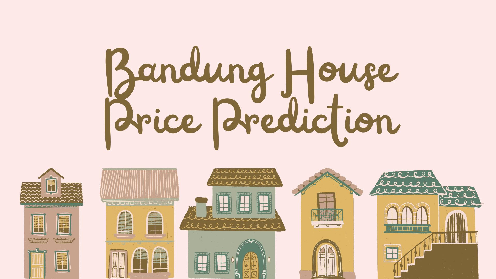

# Bandung House Price Prediction 🏠  

## Project Overview:
The goal of this project is to **predict residential house prices in Bandung** using machine learning regression models.  
By analyzing key property characteristics such as land area, building size, and structural features, this project aims to build a model that can estimate house prices accurately — supporting both buyers and sellers in making data-driven decisions.

---

## Data Dictionary:

| Variable | Description |
|-----------|-------------|
| **price_clean** | Cleaned numerical representation of the listed house price (in IDR). |
| **land_size_clean** | Total land area of the property (in square meters). |
| **building_size_clean** | Total building area of the property (in square meters). |
| **bedroom** | Number of bedrooms in the property. |
| **bathroom** | Number of bathrooms in the property. |
| **carport** | Number of available carports or parking spaces. |

---

## Model Performance Summary:

Three regression algorithms were developed:  
**Linear Regression**, **Random Forest Regression**, and **XGBoost Regression**.

| Model | R² Score | MAE | RMSE | Remarks |
|--------|-----------|-----------|-----------|-----------|
| **Linear Regression** | 0.7213 | High | Moderate | Serves as a baseline linear model |
| **Random Forest Regression** | 0.7765 | Low | Low | Strong generalization and stable predictions |
| **XGBoost Regression** | **0.7838** | **Lowest** | **Lowest** | Best in-sample performance and nonlinearity capture |

While **XGBoost** achieved the highest \(R^2\) score (0.7838), **Random Forest** exhibited better calibration and stability, with residuals tightly distributed around zero and stronger generalization on unseen data.

---

## Conclusion:

From the analysis, it can be observed that the **XGBoost Regression** model achieved the highest overall accuracy, with an \(R^2\) score of 0.7838, slightly outperforming **Random Forest Regression** (0.7765).  
However, residual and distribution analysis revealed that **Random Forest** produced more consistent and well-calibrated predictions, showing tighter error distributions and better generalization when tested with new property data.  

Both ensemble models significantly outperformed **Linear Regression**, with **XGBoost** excelling in in-sample precision and **Random Forest** proving more reliable in real-world testing.  
Key property features such as **land size** and **building size** were found to be the most influential factors determining house prices, followed by the number of **bathrooms**, **carports**, and **bedrooms**.

In conclusion, **Random Forest Regression** stands out as the most balanced and dependable model for house price estimation in Bandung, while **XGBoost** provides higher in-sample accuracy for cases requiring more aggressive learning.  